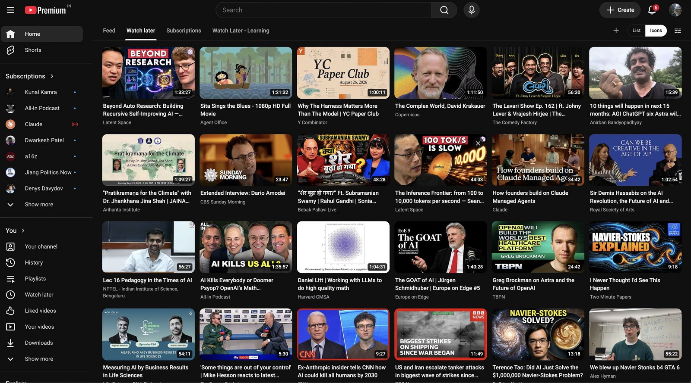
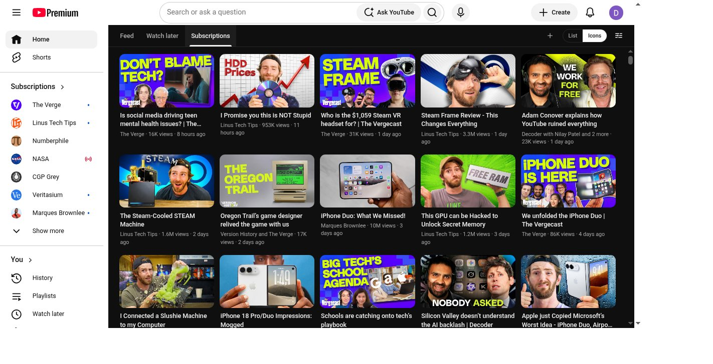
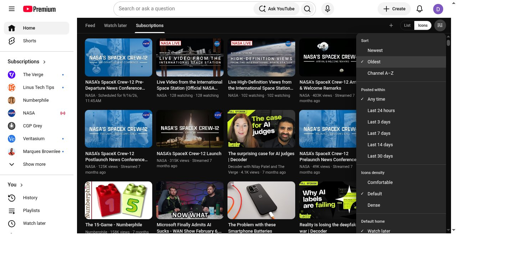

# Diet-Youtube

**A Chrome extension that replaces YouTube’s impulse Home with a queue-first reading surface.**

Watch later is the diet home. The algorithmic Feed stays one extra click away. Subscriptions stay chronological. Custom feeds are named subsets of channels and playlists.

Nothing leaves your browser. Preferences stay in `chrome.storage`. Playlist reads and Watch later edits use YouTube’s own page session (Innertube) — there is no Diet-Youtube backend.

**Author:** [artvandelay](https://github.com/artvandelay) · **Version:** 1.2.0 · **License:** MIT

## Screenshots

Watch later opens as Icons by default — your queue, not For you:



Subscriptions as a chronological Icons grid:



View menu: sort, posted-within, Icons density, and Save as default (per feed). Session changes apply immediately; only Save writes prefs:



## Install (for everyone — no coding)

You do **not** need to know how to code. This installs Diet-Youtube the same way many Chrome extensions are installed before they are in the Chrome Web Store: download a zip, unzip it, then point Chrome at that folder.

### 1) Download the zip

1. Open this page in your browser: [Diet-Youtube releases](https://github.com/artvandelay/diet-youtube/releases/latest)
2. Scroll down to **Assets**.
3. Click **`diet-youtube-v1.2.0.zip`** to download it.

On a Mac, the file usually lands in your **Downloads** folder as:

`Downloads/diet-youtube-v1.2.0.zip`

On Windows it is often the same idea: the **Downloads** folder, with that same filename.

### 2) Unzip it (this creates the folder Chrome needs)

1. Find `diet-youtube-v1.2.0.zip` in Downloads.
2. Unzip it:
   - **Mac:** double-click the zip.
   - **Windows:** right-click the zip → **Extract All…** → Extract.
3. After unzipping, you should see a **folder** named something like:

`Downloads/diet-youtube-v1.2.0/`

Inside that folder you must see a file named **`manifest.json`**. That folder is the one Chrome will load. Do **not** pick the `.zip` file itself.

If unzipping created an extra nested folder (for example `Downloads/diet-youtube-v1.2.0/diet-youtube-v1.2.0/`), open folders until you see `manifest.json`, and use **that** inner folder in the next step.

### 3) Load it in Chrome

1. Open **Google Chrome** (not Safari, not Edge unless you know Edge’s extension page).
2. Click the address bar at the top, type exactly this, and press Enter:

`chrome://extensions`

3. In the top-right corner of that page, turn **Developer mode** **On** (it looks like a switch).
4. In the top-left area, click **Load unpacked**.
5. In the file picker, go to your Downloads folder and select the folder:

`diet-youtube-v1.2.0`

(the folder that contains `manifest.json`). Then confirm / Open.
6. You should now see **Diet-Youtube** listed on the extensions page.
7. Open a new tab and go to [youtube.com](https://www.youtube.com) while signed into YouTube.

You should land on **Watch later** inside Diet-Youtube instead of the normal YouTube Home impulse feed.

Optional: pin the extension. Click the puzzle-piece icon in Chrome’s toolbar, find Diet-Youtube, and click the pin. Then you can click that icon anytime to turn Diet-Youtube **On** or **Off** without uninstalling.

### 4) After an update (new version later)

1. Download the newer zip from Releases and unzip it (for example `diet-youtube-v1.3.0`).
2. Go back to `chrome://extensions`.
3. Either click the circular **reload** icon on the Diet-Youtube card (if you replaced files in the same folder), **or** Remove the old one and **Load unpacked** again on the new folder.

## Uninstall / remove

1. Open Chrome and go to `chrome://extensions`.
2. Find **Diet-Youtube** in the list.
3. Click **Remove**.
4. Confirm when Chrome asks.

YouTube goes back to its normal homepage. You can also delete the unzipped folder from Downloads (for example delete `Downloads/diet-youtube-v1.2.0`) and the zip file if you no longer want them on your computer.

If you only want a temporary break: click the Diet-Youtube toolbar icon and turn it **Off**. That leaves it installed but inactive.

## Install from source (optional, for developers)

Clone this repo, then **Load unpacked** on the repo folder (the one with `manifest.json`). After code changes: `npm test` rebuilds the content bundle.

## What you get

- **One chrome row:** Feed · Watch later · Subscriptions · your custom feeds · ＋ · List/Icons · View
- **Cold start, logo, sidebar Home, watch→home, hard refresh** always open Watch later (or the default home you saved). An empty queue stays empty — it never auto-bounces to Subscriptions or Feed.
- **Feed** only after an explicit Diet-Youtube tab click. It sticks until reload, logo, or Home.
- **Icons** is the default layout; **List** is one click away.
- **View menu:** Sort (Newest / Oldest / Channel A–Z), Posted within, Icons density (Comfortable / Default / Dense). Changes apply to the current tab immediately. **Save as default** is the only write to prefs, per active tab.
- **Faster tabs:** cache-first paint on switch, background refresh, and idle prefetch for Watch later / Subscriptions / custom feeds.
- **Custom feeds:** create/edit sheet, rename, delete with undo, Chrome-like drag reorder.
- **⋮ menu:** Save to Watch later or another playlist (custom feeds, Subs, Feed). Watch later still uses remove.
- **On/Off:** toolbar popup switch; Off shows native YouTube Home.
- **Watch later remove:** hover to remove one, or checkbox / ⌘-click / shift-range + **Remove N**.

## Privacy

Diet-Youtube runs only on YouTube pages in your browser. It does not upload your Watch later or subscriptions list to a Diet-Youtube server. Feeds and view defaults live in `chrome.storage.local`.

## Develop

```bash
npm test          # rebuilds the content IIFE, then runs unit tests
npm run build     # rebuild src/content/content.bundle.js after editing ESM sources
```

Chrome Load unpacked injects `content_scripts` as classic scripts, so the isolated world ships as `src/content/content.bundle.js` (IIFE). Edit `src/content/content.js` and its imports, then `npm run build`.

## Out of scope (for now)

Group-by-channel, Dock-style neighbor magnification, and hover-peek.

## Changelog (short)

- **1.1.0** — Cache-first tabs + prefetch; Icons density; session sort/posted/density vs Save as default.
- **1.0.x** — Greenfield MV3: queue-first home, Feed sticky policy, List/Icons, custom feeds, Watch later remove.
