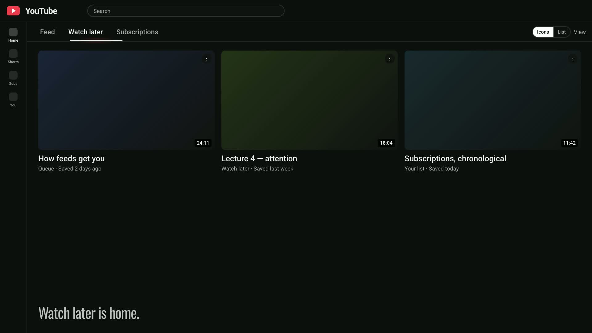
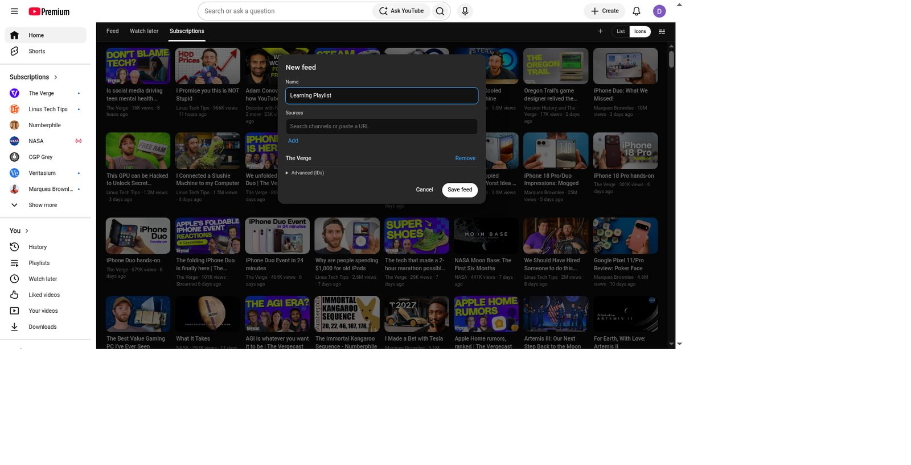

# Diet-Youtube

**A Chrome extension that replaces YouTube’s impulse Home with a queue-first reading surface.**

Watch later is the diet home. The algorithmic Feed stays one extra click away. Subscriptions stay chronological. Custom feeds are named subsets of channels and playlists.

Nothing leaves your browser. Preferences stay in Chrome storage. There is no Diet-Youtube server.

**Author:** [artvandelay](https://github.com/artvandelay) · **Version:** 1.2.0 · **License:** MIT  
**Live page:** [artvandelay.github.io/diet-youtube](https://artvandelay.github.io/diet-youtube/) · **Download:** [latest release zip](https://github.com/artvandelay/diet-youtube/releases/latest)

A 21-second overview plays on the [live page](https://artvandelay.github.io/diet-youtube/#watch) (GitHub’s README does not play the video inline).

---

## How to install (no coding)

Most people arrive on **this page** (the GitHub home for the project). You do **not** need to clone the repository or know how to code. You only need to:

1. Download one zip file from Releases  
2. Unzip it into a normal folder on your computer  
3. Tell Chrome to “Load unpacked” and point it at that folder  

Chrome will show a **Developer mode** warning. That is normal for any extension installed this way (it is not yet on the Chrome Web Store).

### Step 1 — Download the release zip (not the source code)

1. Open the latest release page:  
   **[https://github.com/artvandelay/diet-youtube/releases/latest](https://github.com/artvandelay/diet-youtube/releases/latest)**
2. Scroll down until you see **Assets**.
3. Click the file named exactly:

   **`diet-youtube-v1.2.0.zip`**

**Important:** Do **not** download the files named **“Source code (zip)”** or **“Source code (tar.gz)”**. Those are for developers. Everyday install uses only the Asset named `diet-youtube-v1.2.0.zip`.

#### Where the file goes (concrete examples)

After the download finishes:

| Computer | Typical location of the zip |
| --- | --- |
| **Mac** | `/Users/YOURNAME/Downloads/diet-youtube-v1.2.0.zip`  (Finder → Downloads) |
| **Windows** | `C:\Users\YOURNAME\Downloads\diet-youtube-v1.2.0.zip` |

Replace `YOURNAME` with your login name. If your browser asked where to save the file, use that folder instead of Downloads.

### Step 2 — Unzip it so you get a folder

Chrome cannot load the `.zip` file itself. You must unzip it first so you have a **folder**.

**On a Mac**

1. Open **Finder**.
2. Go to **Downloads**.
3. Find `diet-youtube-v1.2.0.zip`.
4. Double-click the zip.
5. Finder creates a folder next to it named:

   **`diet-youtube-v1.2.0`**

   Full path example: `/Users/YOURNAME/Downloads/diet-youtube-v1.2.0/`

**On Windows**

1. Open **File Explorer**.
2. Go to **Downloads**.
3. Right-click `diet-youtube-v1.2.0.zip`.
4. Choose **Extract All…**, then **Extract**.
5. You should get a folder named:

   **`diet-youtube-v1.2.0`**

   Full path example: `C:\Users\YOURNAME\Downloads\diet-youtube-v1.2.0\`

### Step 3 — Confirm you have the right folder

Open the folder `diet-youtube-v1.2.0`. Inside it you must see a file named:

**`manifest.json`**

You should also see folders such as `icons` and `src`.

- **Correct:** the folder that **directly contains** `manifest.json`  
  Example: `…/Downloads/diet-youtube-v1.2.0/manifest.json`
- **Wrong:** the `.zip` file (`diet-youtube-v1.2.0.zip`)
- **Wrong:** a parent folder that only contains another folder (if you see `diet-youtube-v1.2.0/diet-youtube-v1.2.0/manifest.json`, use the **inner** folder)

Keep this folder somewhere stable (Downloads is fine). Do not delete it while the extension is installed — Chrome reads files from that folder.

### Step 4 — Load the folder in Google Chrome

1. Open **Google Chrome** (Safari cannot install this the same way).
2. Click once in Chrome’s address bar at the top.
3. Type this exactly and press Enter:

   `chrome://extensions`

4. Look at the **top right** of that page. Turn **Developer mode** **On** (the switch should look enabled).
5. After Developer mode is on, look at the **top left**. Click the button **Load unpacked**.
6. A file picker opens. Go to **Downloads**, click once on the folder **`diet-youtube-v1.2.0`**, then click **Open** / **Select**.
   - Select the **folder**, not a file inside it, and not the zip.
7. Chrome should now list an extension card named **Diet-Youtube**.

### Step 5 — Open YouTube and check that it worked

1. Open a new tab.
2. Go to [https://www.youtube.com](https://www.youtube.com) while signed into your YouTube account.
3. You should see Diet-Youtube’s tabs (Watch later, Subscriptions, Feed, and so on) instead of the usual For-you Home.
4. Cold start / logo / Home should open **Watch later** first.

**Optional but useful:** click the puzzle-piece icon in Chrome’s toolbar → find **Diet-Youtube** → pin it. Then you can click that icon anytime and turn the extension **On** or **Off** without uninstalling.

### If something goes wrong

| What you see | What to try |
| --- | --- |
| No **Load unpacked** button | Turn **Developer mode** On (top right of `chrome://extensions`). |
| Chrome says it can’t load the extension / no manifest | You selected the wrong folder or still selected the zip. Open the folder and confirm `manifest.json` is directly inside it, then Load unpacked again. |
| You downloaded something that looks like the whole GitHub repo | You probably grabbed **Source code (zip)**. Delete that, go back to Releases → Assets → download **`diet-youtube-v1.2.0.zip`** only. |
| Extension is listed but YouTube looks normal | Click the Diet-Youtube toolbar icon and make sure it is **On**, then refresh youtube.com. |
| Chrome warns about developer extensions when you restart | Expected for Load unpacked. Choose to keep the extension if you still want it. |

### After a new version is published

1. Download the newer zip from [Releases](https://github.com/artvandelay/diet-youtube/releases/latest) and unzip it (for example `diet-youtube-v1.3.0`).
2. Open `chrome://extensions`.
3. Either remove the old Diet-Youtube card and **Load unpacked** on the new folder, or replace the files inside your existing folder and click the circular **Reload** icon on the Diet-Youtube card.

---

## How to uninstall / remove

1. Open Chrome and go to `chrome://extensions`.
2. Find **Diet-Youtube** in the list.
3. Click **Remove**.
4. Confirm when Chrome asks.

YouTube’s normal homepage comes back. You can also delete the folder and zip from your computer, for example:

- Mac: delete `/Users/YOURNAME/Downloads/diet-youtube-v1.2.0` and `diet-youtube-v1.2.0.zip`
- Windows: delete `C:\Users\YOURNAME\Downloads\diet-youtube-v1.2.0` and the zip

**Pause without uninstalling:** pin the Diet-Youtube icon, open it, and turn **Off**. The extension stays installed but YouTube behaves normally until you turn it On again.

---

## Screenshots

[](https://artvandelay.github.io/diet-youtube/#watch)

21-second overview — tap the poster or open the [live page](https://artvandelay.github.io/diet-youtube/#watch) to play it.

Subscriptions as a chronological Icons grid:


Create a **new feed** — name it and add channels or playlists:



View menu: sort, posted-within, Icons density, and Save as default (per feed):


---

## What you get

- **One chrome row:** Feed · Watch later · Subscriptions · your custom feeds · ＋ · List/Icons · View
- **Cold start, logo, sidebar Home, watch→home, hard refresh** always open Watch later (or the default home you saved). An empty queue stays empty — it never auto-bounces to Subscriptions or Feed.
- **Feed** only after an explicit Diet-Youtube tab click. It sticks until reload, logo, or Home.
- **Icons** is the default layout; **List** is one click away.
- **View menu:** Sort (Newest / Oldest / Channel A–Z), Posted within, Icons density (Comfortable / Default / Dense). Changes apply to the current tab immediately. **Save as default** is the only write to prefs, per active tab.
- **Faster tabs:** cache-first paint on switch, background refresh, and idle prefetch for Watch later / Subscriptions / custom feeds.
- **Custom feeds:** create/edit sheet, rename, delete with undo, Chrome-like drag reorder.
- **⋮ menu:** Save to Watch later or another playlist (custom feeds, Subs, Feed). Watch later still uses remove.
- **On/Off:** toolbar popup switch; Off shows native YouTube Home.
- **Watch later remove:** hover to remove one, or checkbox / ⌘-click / shift-range + **Remove N**.

## Privacy

Diet-Youtube runs only on YouTube pages in your browser. It does not upload your Watch later or subscriptions list to a Diet-Youtube server. Feeds and view defaults live in `chrome.storage.local`.

## Install from source (optional, for developers)

Clone this repo, then **Load unpacked** on the repo root (the folder that contains `manifest.json`). After code changes:

```bash
npm test          # rebuilds the content IIFE, then runs unit tests
npm run build     # rebuild src/content/content.bundle.js after editing ESM sources
```

Chrome Load unpacked injects `content_scripts` as classic scripts, so the isolated world ships as `src/content/content.bundle.js` (IIFE).

## Out of scope (for now)

Group-by-channel, Dock-style neighbor magnification, and hover-peek.

## Changelog (short)

- **1.2.0** — YouTube-style ⋮ save to Watch later / playlists; toolbar On/Off; release zip + non-coder install docs.
- **1.1.0** — Cache-first tabs + prefetch; Icons density; session sort/posted/density vs Save as default.
- **1.0.x** — Greenfield MV3: queue-first home, Feed sticky policy, List/Icons, custom feeds, Watch later remove.
